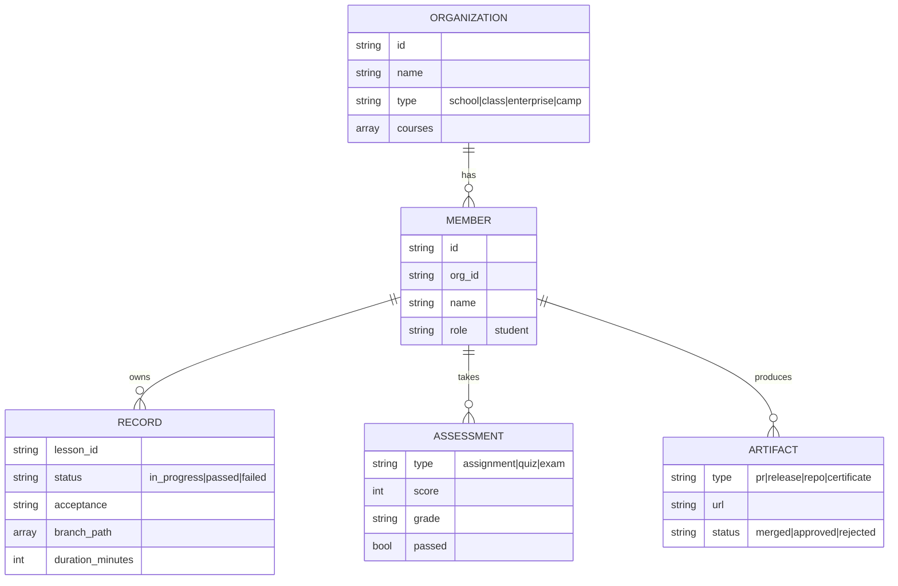

# 学习管理档案设计

量潮学习云的学习管理档案（Learning Profile）配套设计：以「组织-成员」两级结构承载学员的学习轨迹、考核记录、产出物与能力画像，同时服务课堂成绩（高考模式）与招聘选拔（竞赛模式）两条线。

## 两级结构

「组织-成员」是扁平的两级：任意粒度的群体（学校、班级、校企合作项目、训练营）都抽象为组织，成员是学员。需要细分群体时用组织属性（类型、标签）表达，不增加层级。

- 组织是数据边界与权限边界：成员档案挂在自己的组织下，组织只能看本组织成员
- 成员档案内部按四个区组织：轨迹、考核、产出、画像

## 档案内容

成员档案分四个区，含金量从低到高：

1. 学习轨迹：课时进度、场景分支路径、耗时、验收结果
2. 考核记录：作业、测验、考试的评分与评级
3. 产出物：PR、Release、作品仓库、证书等真实产出，含链接与状态
4. 能力画像：由以上三者推导的能力标签

排序即价值观：产出物优先于考核，考核优先于轨迹。招聘（竞赛模式）看产出物与画像，不看进度。

## 与现有领域模型的关系

qtcloud-learn 已有 class / student / session / assessment / submission / enrollment / progress 实体，档案在其上聚合，补充两个新概念：

| 档案区 | 承载实体 | 状态 |
|--------|---------|------|
| 学习轨迹 | progress、session | 已有 |
| 考核记录 | assessment、submission | 已有 |
| 产出物 | artifact | 需新增 |
| 能力画像 | skill profile | 需新增 |

组织-成员两级对应现有 class-student 模型，组织是班级的泛化（school / class / enterprise / camp 统一抽象）。

## 验收判定

成员课时的通过状态（passed / failed）由服务端读取课程档案中的 acceptance 判定：自检类（self-check）验收通过 = 轨迹满足 criteria；真实反馈类（real-world）验收通过 = 产出物满足 criteria（如 PR 被合并）。播放器只负责上报轨迹，不判完成。

## 落地路径

1. provider 新增 artifact 实体与能力画像推导逻辑
2. 服务端读取课程 acceptance，自动判定成员课时通过状态
3. 组织端汇总视图（通过率、产出统计）与成员端档案页
4. 招聘（竞赛模式）入口直接读取画像与产出物

## 数据模型

